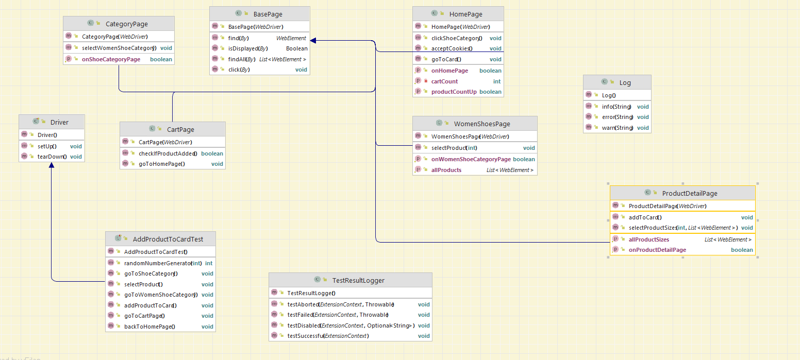
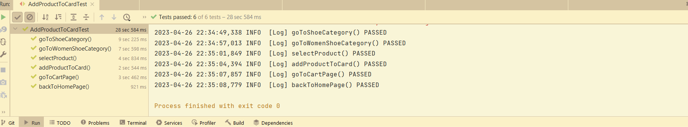

# LcwaikikiBasicSeleniumProject

This project used for  Lcwaikiki e-commerce website.

Steps;

1. Go to https://www.lcwaikiki.com/tr-TR/TR.
2. Go to any category page.
3. Go to any product page.
4. Add the product to the cart.
5. Go to the cart page.
6. Go back to the homepage.

● Chrome drive, JUnit used

● Page Object Modal is used.

● After the test is finished, the driver is turned off.

● Assertion is used at every step to check the correctness of the pages.

The project uses Selenium WebDriver for testing web applications and includes the following dependencies:

- selenium-java (version 4.8.1): The main Selenium Java library that provides a programming interface for controlling web browsers.
- webdrivermanager (version 5.3.2): A Java library for managing WebDriver binaries automatically.
- junit-jupiter-engine (version 5.8.2): A unit testing framework for Java.
- log4j (version 1.2.17): A Java-based logging utility for generating log messages from applications.

